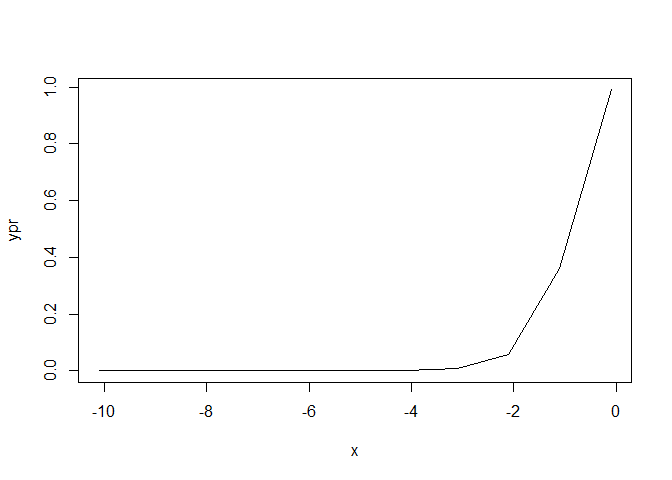

Examen
================
Miguel Jara
24/7/2021

# Ejercicios

## 1.- Realizar un gráfico tipo linea que muestre el comportamiento de la función tangente hiperbólica y su derivada

``` r
e<-2.71
x<- seq(-10.10,0.5)
y<- ((e^(2*x)-1)/(e^(2*x)+1))
plot(x,y,type="l")
```

<!-- -->
\#\#\#Derivada

``` r
ypr<-((4*e^(2*x))/(e^(2*x)+1)^2)
plot(x,ypr, type="l")
```

<!-- -->
